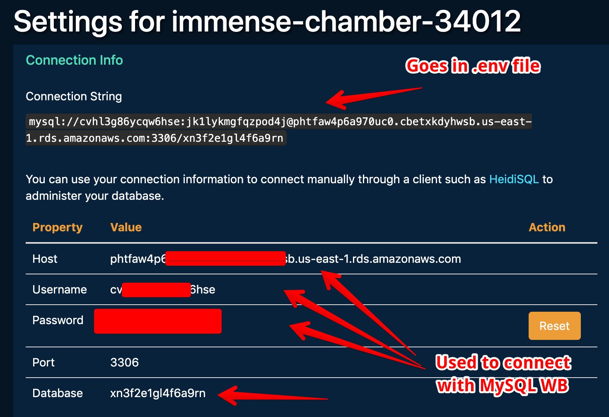

## Welcome to Eat-Da-Burger

* Eat-Da-Burger! is a restaurant app that lets users input the names of burgers they'd like to eat.

* Whenever a user submits a burger's name, your app will display the burger on the left side of the page -- waiting to be devoured.

* Each burger in the waiting area also has a `Devour it!` button. When the user clicks it, the burger will move to the right side of the page.

* Your app will store every burger in a database, whether devoured or not.

* [Check out this video of the app for a run-through of how it works](https://youtu.be/msvdn95x9OM).

* Heroku link: https://immense-chamber-34012.herokuapp.com/

## My pitfalls
- Error Code: 1142 SELECT command denied to user 'cvhl3g86ycqw6hse'@'96.42.208.204' for table 'user_variables_by_thread'
- Upgraded the db on Heroku to version 8
- Connected MySQL Workbench to the cryptic databases displayed on my Heroku dashboard
- See the attached image for assistance

